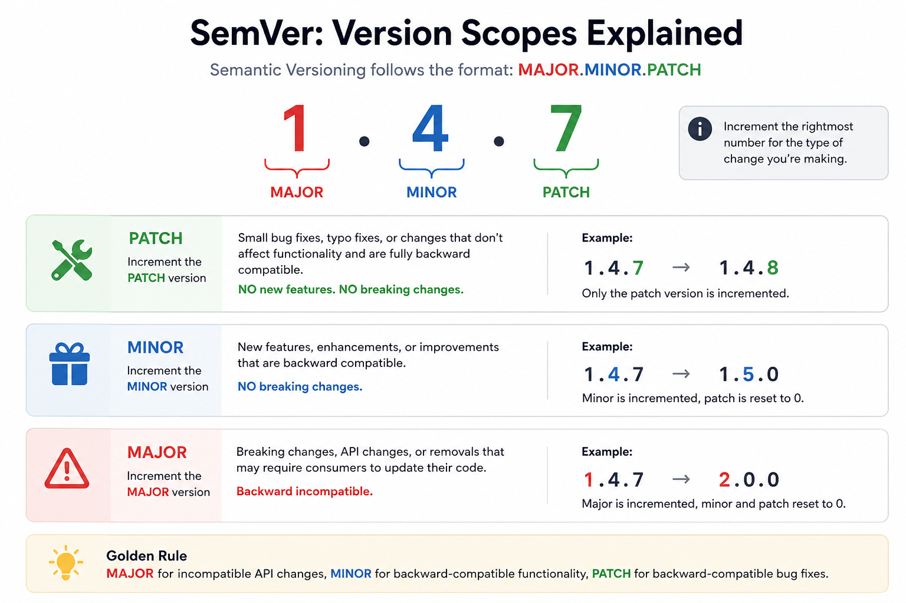

# Git Publish CLI

A cross-platform Java 21 and Picocli Git extension that:

1. Discovers the current repository and branch.
2. Validates the tag format against the current branch.
3. Verifies that the working tree is clean.
4. Fetches the current remote branch and tags.
5. Verifies that the local branch is synchronized with `origin`.
6. Rejects existing local or remote tags.
7. Creates and pushes an annotated tag.
8. Calls the Jenkins endpoint mapped to the repository.
9. Supports a write-free dry run.
10. Calculates the next major, minor, or patch version automatically.
11. Generates `CHANGELOG.md` from Git commit subjects and commits it before tagging.

## Tag policies

| Type | Format | Allowed branch |
|---|---|---|
| Release | `vX.Y.Z` | `main` by default |
| Release candidate | `vX.Y.Z-rc0.NN` | `develop` by default |
| Alpha | `vX.Y.Z-alpha0.NN` | Any branch except `main`, `master`, release, or develop |

The requested `rc0.01` and `alpha0.01` formats are supported exactly. Note that their numeric identifiers with leading zeroes are not strict SemVer 2.0.0 numeric identifiers.

## Build

Requirements:

- Java 21
- Maven 3.9+
- Git available in `PATH`

```shell
mvn clean package
```

The executable fat JAR is generated at:

```text
target/git-publish.jar
```

## Configuration

Copy:

```text
config/config.example.yml
```

to:

```text
Windows: %USERPROFILE%\.git-publish\config.yml
Linux/macOS: ~/.git-publish/config.yml
```

The project key must match the name derived from `git remote get-url origin`.

Example:

```yaml
releaseBranch: main
releaseCandidateBranch: develop

projects:
  payment-service:
    url: "https://jenkins.example.com/job/payment-service/build"
```


## Windows installation

Build and run:

```powershell
.\install-windows.ps1
```

Open a new PowerShell or CMD window, then:

```powershell
git publish --help
```

The installer creates `git-publish.cmd` in a directory included in your user `PATH`. Git discovers the launcher and exposes it as the `git publish` extension.

## Automatic Semantic Version incrementing

Instead of supplying a full tag, pass `major`, `minor`, or `patch`.

### Short explanation




The latest stable tag is used as the base version:

```text
Latest stable tag: v1.4.2
git publish patch -> v1.4.3
git publish minor -> v1.5.0
git publish major -> v2.0.0
```

The current branch determines the generated tag category:

```text
main  + minor -> v1.5.0
develop + minor -> v1.5.0-rc0.01
feature + minor -> v1.5.0-alpha0.01
```

If the same pre-release base already exists, the sequence is incremented:

```text
v1.5.0-rc0.01 -> v1.5.0-rc0.02
v1.5.0-alpha0.01 -> v1.5.0-alpha0.02
```

## Changelog generation

Add `--changelog` to generate or update `CHANGELOG.md`.

```shell
git publish patch --changelog
git publish minor --changelog --dry-run
```

Commits are collected from the latest reachable tag through `HEAD`. Conventional Commit prefixes are grouped into:

- Breaking Changes
- Features
- Bug Fixes
- Performance
- Documentation
- Other Changes

When not running in dry-run mode, the CLI:

1. Prepends the new release section to `CHANGELOG.md`.
2. Creates a commit named `docs: update changelog for <tag>`.
3. Pushes the changelog commit to the current branch.
4. Creates the annotated tag on that new commit.
5. Pushes the tag.
6. Triggers Jenkins.

## Usage

```shell
git publish v1.2.0
git publish v1.2.0-rc0.01
git publish v1.2.0-alpha0.01
git publish v1.2.0-alpha0.01 dryrun
git publish v1.2.0-alpha0.01 --dry-run
git publish patch
git publish minor --changelog
git publish major --changelog --dry-run
```

Use another configuration:

```shell
git publish v1.2.0 --config C:\tools\git-publish.yml
```

## Failure behavior

- If tag creation succeeds but the remote push fails, the newly-created local tag is removed.
- If the remote push succeeds but Jenkins fails, the remote tag is retained. This prevents silently rewriting published Git history.
- Dry-run still performs read-only Git operations such as fetch and validation so the simulation reflects the real operation.
